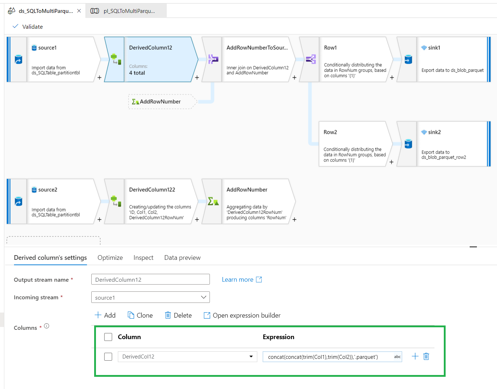
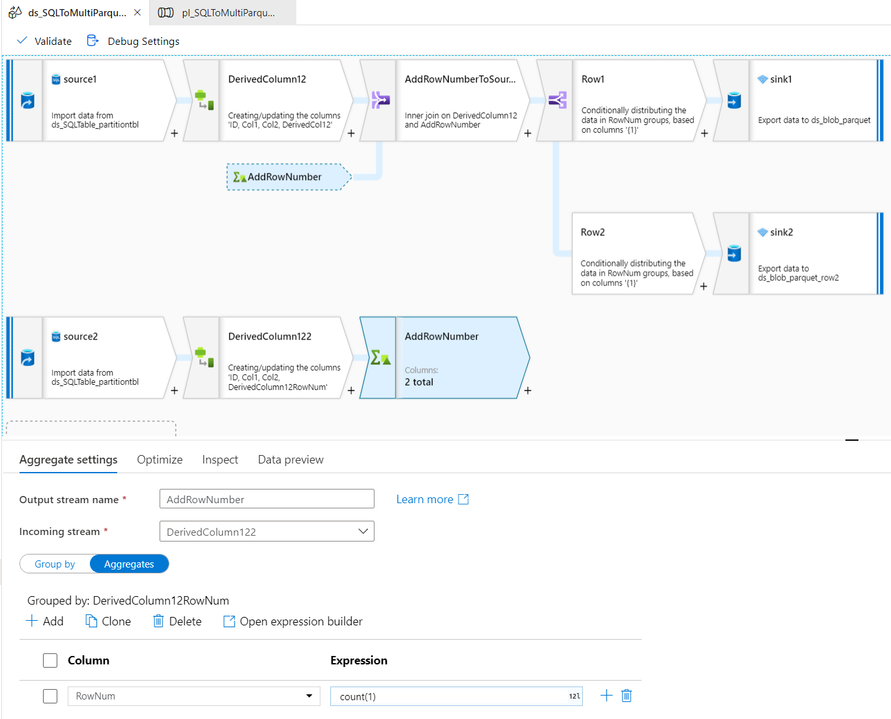
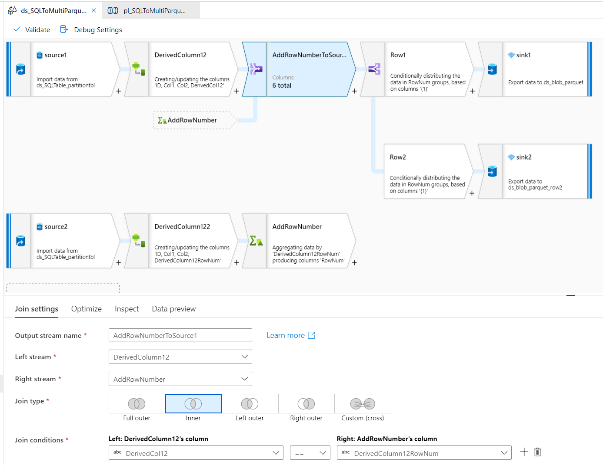
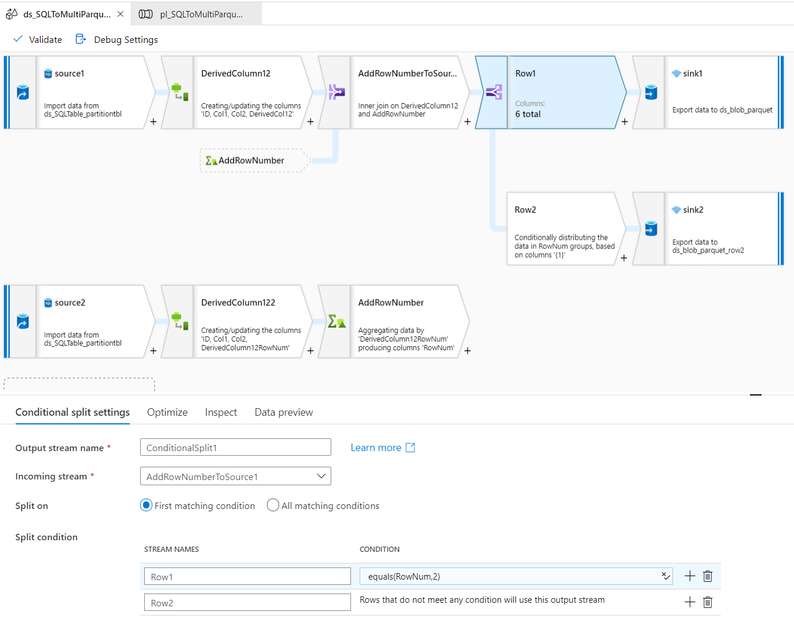
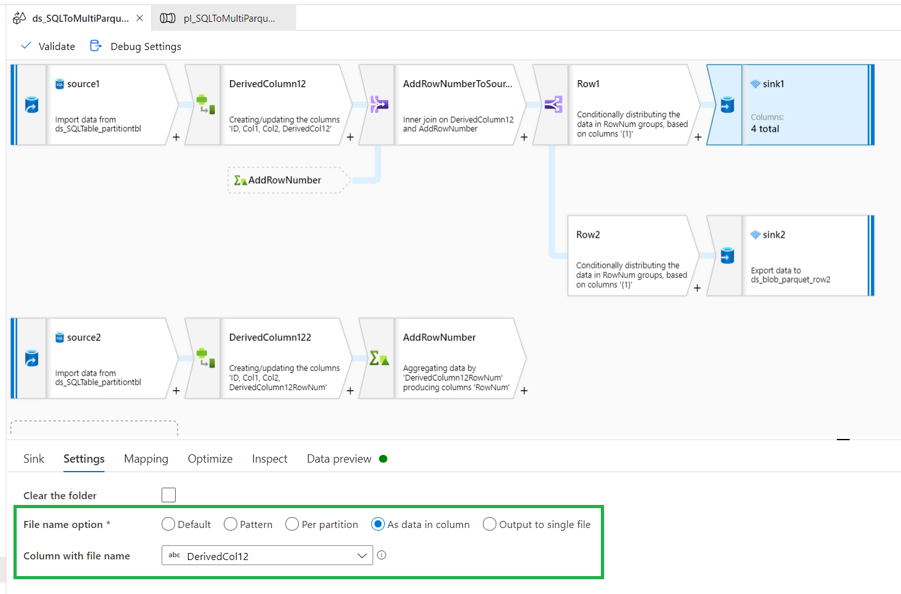

One of Azure Machine Learning many-model project need to convert large Azure SQL Database to multiple parquets due to panda dataframe has limitation and cannot process large 10GB dataset, use ADF to convert data for many-model dataset access. 

The ADF pipeline will archive below goals:
* AML many-model needs to convert Azure SQL Database table to parquet files stored on blob storage. 
* AML many-model needs based on two columns to do partition since it's related with group_column_name and grain_column_names 
* few rows in parquet file is unable to train AML many-mode, need to determinate qualified parquet files. Will use ADF dataflow conditional split to store data in two different blob storage folders. 
* AML many-model cannot use longer file name, need to use short file name. 

ADF pipeline design as below:

* Row data from SQL DB

```
CREATE TABLE [dbo].[partitiontbl](
	[ID] [int] NULL,
	[Col1] [char](124) NULL,
	[Col2] [char](124) NULL
)

	INSERT INTO [dbo].[partitiontbl] VALUES (1, 'WA', 'Seattle' ) 
	INSERT INTO [dbo].[partitiontbl] VALUES (2, 'WA', 'King' )  
	INSERT INTO [dbo].[partitiontbl] VALUES (3, 'WA', 'Seattle' )  
	INSERT INTO [dbo].[partitiontbl] VALUES (4, 'OR', 'Portland' )  
	INSERT INTO [dbo].[partitiontbl] VALUES (5, 'OR', 'Portland' )  
	INSERT INTO [dbo].[partitiontbl] VALUES (6, 'OR', 'Eugene' )  


```

* Added Derived column activity to get a combined column from the two columns of raw table



* added aggregate activity for row count



* Added join activity to get row count in source 1 table


* Conditional split activity to split data to two stream based on row count. 


* set partition. Note: if "Set Partitioning" with "Key" column to two columns under "Optimize" also would get partition, but will generated multi-folders for each parquet files. 
