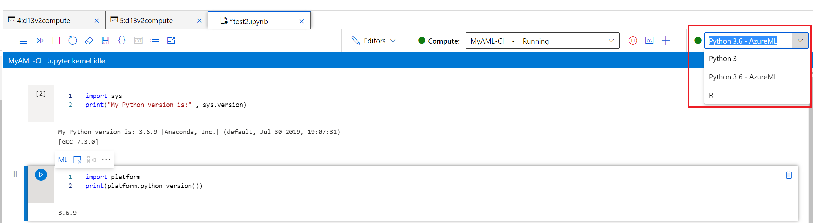
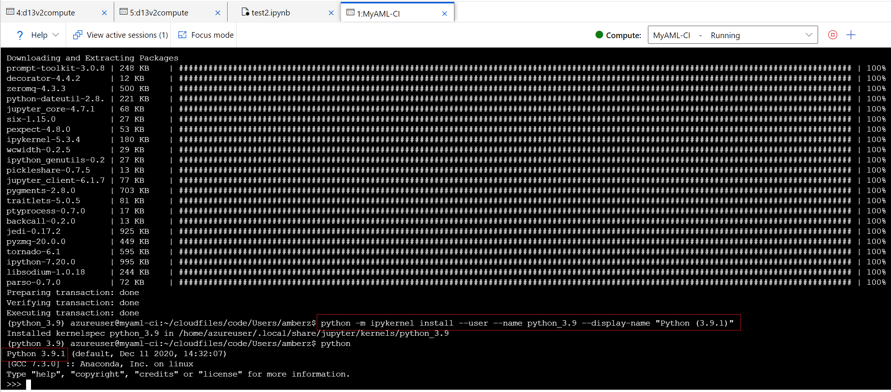
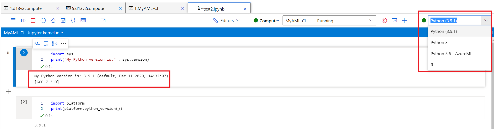

By default AML provides Python 3.6, you may want to upgrade to the latest version for some reasons, this tutorial will guide how to upgrade Python version in AML compute instance. 

Current Python version in AML compute instance is 3.6


1. Open terminal 

1. Crete conda environment 
 
```
conda create --name python_3.9 python=3.9 
```

3. activate conda environment

```
conda activate python_3.9 
```

4. install pip and ipykernal 
```
conda install pip
conda install ipykernel
python -m ipykernel install --user --name python_3.9 --display-name "Python (3.9.1)"
```


5. restart kernal


Check the new Python version in AML compute instance is 3.9


Refer Azure Link: (Access a compute instance terminal)[https://docs.microsoft.com/en-us/azure/machine-learning/how-to-access-terminal#install-packages]