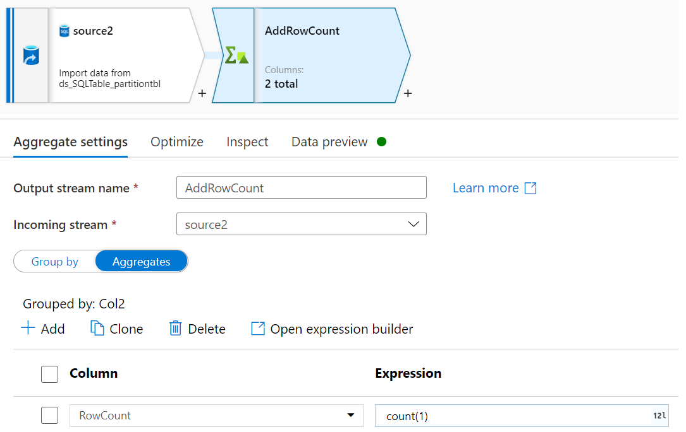
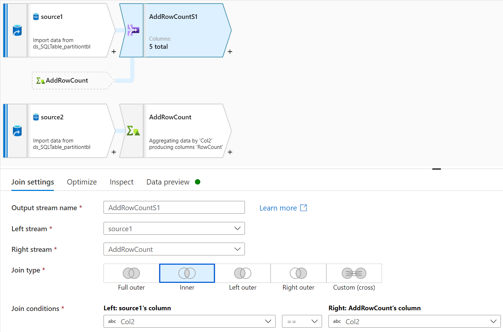
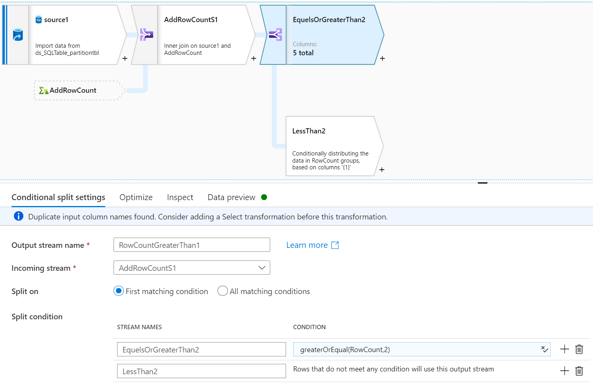
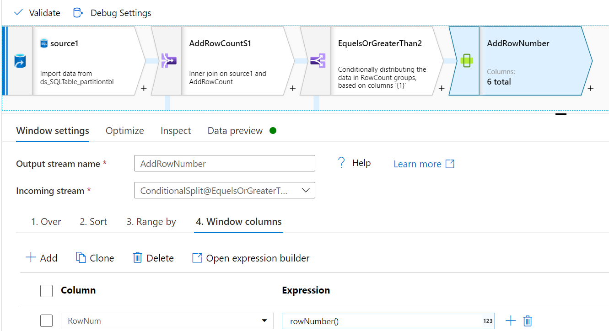
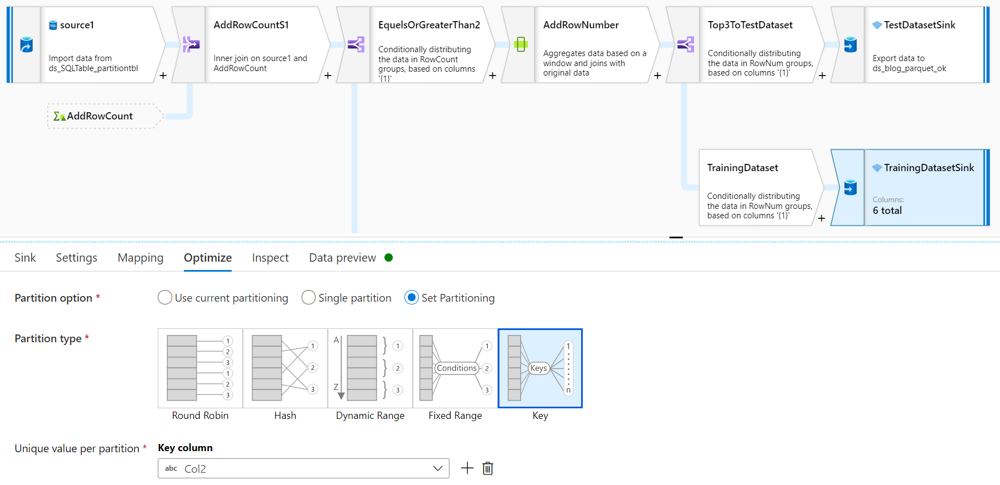
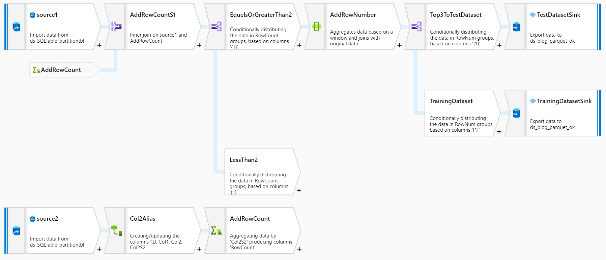

# Use Data Factories to process data for automated machine learning(Automl)

Automated machine learning(Automl) would train, tune and gain best model automatically using target metric you specify for classification, regression and time-series forecasting. 

But current raw data from data warehouse or transactional database would be huge for dataset of machine learning model. You would [optimize data processing](https://docs.microsoft.com/en-us/azure/machine-learning/concept-optimize-data-processing) via increase RAM of VM, another option is partitioning dataset to parquet file before training models. [Parquet file](https://parquet.apache.org/) formats are recommended for machine learning tasks since it's binary columnar format.

Azure Data Factory is a data transformation service, using it would process AML data from below three catagories. 

1. Remove unqualified data.

    For [many-models solution](https://github.com/microsoft/solution-accelerator-many-models), you would want to remove unqualified files, such as: a flat file with zero row. 

1. Split training data and test data. 
    
     It would split training data and test data per partition. 

1. Partition large data to parquet files before training model. 

    A good example is when use [pandas dataframe](https://pandas.pydata.org/pandas-docs/stable/getting_started/overview.html), Pandas dataframe works well for data sizes less than 1GB. However, if the data is larger than 1GB, Pandas dataframe will slow down to process data and you may encounter a run-time memory error. 


## Preparation
Use a table of Azure SQL Database as raw data. 
```
CREATE TABLE [dbo].[Transaction](
	[ID] [int] NULL,
	[Col1] [char](124) NULL,
	[Col2] [char](124) NULL
) 
```

## Convert data format to parquet
Data flow is recommended to use convert a table of Azure SQL Database to parquet file format. 

**Source Dataset**: Transaction table of Azure SQL Database

**Sink Dataset**: Blob storage with Parquet format


## Remove unqualified files
Let's suppose to remove row count less than 2.

1. Use Aggregate activity to get row count row: Group by based on Col2 and Aggregates with count(1) for row count. 


1. Add row count column, this will be a condition in later steps. 


1. Use Conditional split activity to remove unqualified row, this example will be row less than 2.  




## Split training data and test data. 

1. Use Window activity to add one column as row number for each partition. 
In **Over** tab choose column for partition, give order in **Sort** tab, and add one column as row number in each partition. 


1. Use conditional split to split each partition top 3 row to test dataset, and the rest data to training dataset. 


## Partition training dataset and test dataset

In **Optimize** tab, using **Unique value per partition** to set a column as a column key for partition.  


Looks back the entire pipeline logic: 



